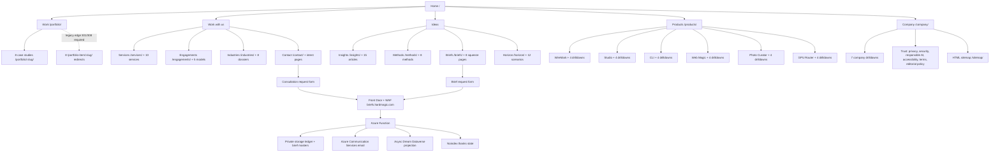

# HardMagic website go-live plan

Status: **not release-ready until every P0 gate below has dated evidence**  
Prepared: 2026-08-20  
Scope: public website, GitLab/GitHub Pages release path, BriefLock, Azure Functions/Front Door/Storage/Email, Dream Dataverse projection, and launch operations.

This is the execution contract for the Luna fanout. It is intentionally deterministic: each work package has an owner boundary, dependencies, outputs, tests, and an acceptance gate. Passing a source-level check does not substitute for proving the deployed behavior.

## Execution status — 2026-08-31

The 2026-08-31 candidate snapshot below was source-ready for the protected
site-release pipeline. Its “no production writes or funnel submissions” statement
is historical; the dated controlled canary evidence below supersedes it for the
valid brief path. This plan still is not a blanket production-release approval:
editorial, legal, accessibility, rollback, and failure-path gates remain open.

Integrated and verified against the isolated public candidate:

- reserved `/briefs/` from the catch-all editorial route, removing the Astro build conflict;
- made deployment target/base-path behavior explicit (`public` root and `demo` `/hardmagic`) and added demo noindex handling;
- added `public/robots.txt`, canonical sitemap policy, and redirect/private-state sitemap exclusions;
- generated route, link, CTA, media, visual-sitemap, rendered-route, brief, funnel, approval, operations, hosting, and release-manifest evidence;
- added link/CTA/rendered audits to the CI verification sequence and packaged the evidence with both demo and protected public release artifacts;
- aligned native forms, server validation, idempotency, consent separation, safe thanks redirects, 48-hour delivery configuration, and Dataverse field projection;
- generated all eight substantive source PDFs with checksums and a parity manifest;
- added browser/axe/no-JavaScript/viewport harnesses and bounded preview-server lifecycle controls.

Candidate evidence: 153 HTML outputs, 135 canonical sitemap URLs, 18 noindex states, 8 redirect states, 9 thanks states, 20,399 references, 14 forms, 155 built media assets, 66 rendered media assets in the ledger, 644 CTA actions across 145 routes, 0 CTA mapping failures/review targets after intentional utility-anchor classification, and 0 link/rendered-route audit failures. The candidate release manifest records artifact SHA-256 `9a5fc9b83d1622b558b69cf5cc682eafcca049e0c5d6454ebdcffbcf2fe9df27`; the rendered-route, audit, and capture manifests record build fingerprint `9164f81e7cbf8d3edfbc4e9fd6d67981f98d9c3bb12ed0ad5654c825ec34e1a7`.

Website source checks are green: `npm run check` reports 0 errors, 0 warnings, and 0 hints; `npm run typecheck:ts7` passes; and `npm run test:all` passes with 6/6 core Vitest files (35 passed, 3 skipped) followed by 2/2 release files (3 passed). Route/sitemap/media/CTA/rendered audits pass, and the public link graph has zero failures with 14 classified review warnings. The separate BriefLock Function package now passes its Node 24 typecheck, build, and 50/50 tests; its cloud checks remain deployment-lane evidence rather than proof from this website aggregate.

Full browser validation against the exact public artifact is recorded in `docs/release-evidence/visual/browser-run.md`: `npm run test:browser` produced 758 passed, 20 expected skips, and 29 host-environment failures; the two transient Chromium route failures passed targeted reruns, and the 27 WebKit launch failures were due to missing host ICU 74/XML2 libraries. Containerized WebKit validation passed 26 cases with 1 expected skip, and targeted Chromium route smoke passed 2 cases. Browser evidence validates the candidate artifact only; it does not prove production deployment or live funnel delivery.

Protected deployment and the public mirror now have dated evidence in the 2026-09-01
verification delta below. The candidate release manifest intentionally keeps
`publicMirrorVerified`, `renderedUrlTests`, and `deployedHostVerified` false until
the release-owner evidence package is signed; those flags are not a live-site
health signal. Protected `/hardmagic/` demo access-control/UAT, public DNS/TLS/
headers/redirect/CDN freshness, the remaining funnel case groups, brief editorial/
accessibility/legal/rights approvals, operations rehearsal, and named release-owner
approvals remain open. The plan remains not release-ready until those gates have
dated evidence.

Azure posture was read back against subscription `6e60a8fd-9992-4ff7-8a3e-db96b4dfed4f` and resource group `rg-hardmagic-briefs`: the Function is healthy through Front Door (`/api/health` 200) and denied at its direct origin (403), the scheduled failure rule is enabled at severity 1 with a 5-minute evaluation/10-minute window, and its source/live KQL hashes now match (`395037ab30236291d7bf842a64b912e0f0644002792c7e408aaaca2752fd8307`). The corrected query returns `FailureCount=0` over the current and historical 36-hour windows. Function diagnostics export only `FunctionAppLogs` with metrics disabled. The tested Function package from protected package job `1018315` was deployed to the existing app (package SHA-256 `4eaf83b5e81631f631203b690d5be8e88587516f4297ff57be2ade667348415f`), and non-side-effecting smoke checks return JSON `400`, unsupported `text/plain` `415`, health `200`, and a valid-origin preflight `204`. The protected GitLab what-if/manual promotion remains a separate release-evidence gate. No Logic App resource exists in this resource group; the delivery path is Function plus Storage queues.

### Incident remediation — 2026-09-01

Three distinct Azure alert activations (01:03, 10:08, and 19:38 UTC on 2026-08-31) were false positives from normal Flex worker scale-in telemetry, not HardMagic intake failures. The old query treated the exact `Exception encountered while listening to EventStream` companion as an error and correlated events in arbitrary one-second bins. The live rule was updated at 01:04 UTC to the source-controlled query: it scopes to the HardMagic Function role/resource, selects messages without empty-string coalescing, requires a non-empty worker instance, and suppresses only the two observed complete lifecycle patterns. Any unpaired or additional exception remains alertable. The action group still targets `admin@focushive.com`; M365 Graph reads confirmed the connection is healthy and no re-authentication was required.

### Current verification delta — 2026-09-01

Protected pipeline `56132` passed the Function tests/package, PDF package, Bicep
validation, and what-if. Deployment job `1018319` completed the corrected Function
package and the edge deployment. The public Pages artifact was published through the
protected mirror path; the live site returns 200 and serves the Generative Media brief.

The controlled brief canary in
[`docs/release-evidence/funnels/canary-2026-09-01.md`](release-evidence/funnels/canary-2026-09-01.md)
returned the expected 303, delivered one ACS message, projected the full live
Dataverse schema with HardMagic Account/BU/team ownership, survived the bounded CRM
retry after the owner-team role was corrected, and was fully cleaned up. `TURNSTILE_REQUIRED`
was restored to `true`. This closes the valid-brief-path evidence gap; the remaining
case groups and named approvals are intentionally still open.

## 1. Current-state finding

The site is substantial and publicly reachable, but the release evidence is incomplete and internally inconsistent.

- Astro 7.2.9 builds 153 HTML outputs. The candidate classifies 135 routes as canonical/indexable, 18 as noindex, 8 as legacy redirects, 9 as thanks states, and 1 as the not-found output. The generated XML sitemap contains exactly the 135 canonical URLs and excludes thanks and redirect-only states.
- The machine-owned `docs/route-ledger.*`, `docs/link-ledger.csv`, `docs/cta-ledger.csv`, `docs/media-ledger.*`, and `docs/visual-sitemap.md` are now regenerated from one isolated candidate. They are evidence inputs, not substitutes for human approval of copy, rights, or deployed behavior.
- The rendered candidate contains 14 forms posting to `https://briefs.hardmagic.com`. A read-only health check returned HTTP 200 with `ok: true` and `configured: true` on 2026-08-20. This proves only edge reachability/configuration, not submission, email, private document, CRM, retry, or suppression behavior.
- The live public host is not serving this candidate: `https://hardmagic.com/` returned HTTP 200 on 2026-08-20, but its live `robots.txt` is an older content-signals document without the canonical sitemap, and `/portfolio-item/airikai/` returned HTTP 200 rather than an edge 301/308. Treat the deployed artifact, robots policy, legacy redirect policy, and CDN freshness as drift until the protected release path is run and rechecked.
- Brief infrastructure documentation conflicts: the README lists external work as outstanding while `DEPLOYMENT-RECORD.md` says the system was verified on 2026-08-12. Reconcile the documents against deployed resource state.
- Website source checks (`npm run check`, `npm run typecheck:ts7`, and `npm run test:all`) and isolated route/media/CTA/rendered/link audits pass. Browser results, including host-environment failures and containerized/targeted reruns, are recorded in `docs/release-evidence/visual/browser-run.md`; a clean `npm run verify` and deployed-edge checks remain separate release gates.
- The current public-root build is warning-free for the `/briefs` route, and the rendered route, audit, and capture manifests share fingerprint `9164f81e7cbf8d3edfbc4e9fd6d67981f98d9c3bb12ed0ad5654c825ec34e1a7`. The release manifest remains candidate-only; protected demo UAT/access control and public mirror/edge verification are open.
- CI now uses explicit deployment targets and packages release evidence, but protected public mirror freshness, DNS/TLS, edge headers, redirects, and rollback remain deployment-owner evidence rather than repository assertions.
- The eight generated PDFs now have substantive content, source/provenance metadata, page/text/citation/accessibility checks, checksums, and landing-page parity evidence. Editorial, accessibility, legal/rights, storage-upload, expiry, and delivery approvals remain open.
- Historical transcripts establish non-negotiable intent: GitLab remains source of truth; `demo` is an internal preview behind Ziti; `gh-pages` is the canonical public branch mirrored to GitHub; portfolio work remains visible; visual evidence must distinguish genuine work, sourced facts, inference, scenarios, and conceptual art; private briefs use separate resource and marketing consent; and fixture/benchmark output must never be presented as real-world proof.

## 2. Launch information architecture

The canonical public hierarchy is below. The implementation must generate the full route and link ledgers from built HTML; this diagram is the human navigation model, not a substitute for that graph.



## 3. Required planning artifacts

The first execution wave must regenerate these artifacts from one immutable release candidate. CSV/JSON files are machine-owned; Markdown files are reviewer-owned summaries.

| Artifact | Required content | Gate |
| --- | --- | --- |
| `docs/release-evidence/release-manifest.json` | commit, package-lock hash, build time, environment, base path, artifact hash, infrastructure versions | One immutable identity joins all evidence |
| `docs/route-ledger.md` + `.json` | every rendered, redirected, noindex, sitemap-excluded, error, success, and external application state | Source, built, sitemap, and crawler counts reconcile |
| `docs/link-ledger.csv` | source route, element, label, raw URL, resolved URL, type, status, final URL, fragment, owner | Every internal and external link mapped; zero unexplained failures |
| `docs/cta-ledger.csv` | route, audience intent, CTA copy/position, target, solution, funnel stage, fallback | Every route has an intentional primary and early-stage next action |
| `docs/conversion-ledger.md` | CTA → squeeze page → form → edge → Function → email/PDF/CRM → result/error/monitor/rollback | Every conversion edge has an owner and evidence |
| `docs/media-ledger.md` + `.json` | route assignment, source, rights, disclosure class, alt decision, crop/focal point, duplication | No unknown rights/provenance or unintended route repetition |
| `docs/visual-sitemap.md` | Mermaid hierarchy plus links to route contact sheets | Matches the generated route ledger |
| `docs/release-evidence/visual/` | route contact sheets and flagged full-page captures | Every route reviewed at 390 px and desktop |
| `docs/release-evidence/briefs/` | edition manifest, checksums, page/text/citation/accessibility results, storage version | All eight private editions match their squeeze pages |
| `docs/release-evidence/funnels/` | redacted canary result and correlation IDs, timestamps, deployment IDs | End-to-end paths proved without retaining test PII |
| `docs/release-evidence/approvals.md` | content, brand, legal/privacy, accessibility, security, infrastructure, release owner | Named approvals, dates, exceptions, expiry |

## 4. P0 work packages — must complete before launch

### P0-01 — Freeze and identify the release candidate

Owner: release integrator. Exclusive scope: release evidence and pipeline configuration.

1. Select one commit; record commit SHA, lockfile hash, Astro version, Node version, and all deployment artifact hashes.
2. Preserve the user's existing README change. Do not fold unrelated working-tree changes into the candidate.
3. Make builds reproducible from a clean checkout with pinned runtime/container versions and no network-installed CLI packages during a protected deployment.
4. Replace `CI ? '/hardmagic' : '/'` with an explicit deployment-target variable validated by tests:
   - local/public custom domain: `/`;
   - GitLab demo subpath: the actual Pages project path;
   - fail closed for unknown values.
5. Document exactly how GitLab `gh-pages` is built, mirrored to GitHub, published to `hardmagic.com`, and rolled back. Add a protected public-release pipeline if this path is currently manual or implicit.

Acceptance: demo and public artifacts are built from the same commit, differ only in declared environment configuration, and pass canonical/base/link tests at their actual URLs.

### P0-02 — Build the authoritative route, redirect, sitemap, and link graph

Owner: route/link worker. Exclusive scope: route/link audit scripts, sitemap configuration, generated ledgers; no page copy edits.

1. Crawl built output using browser URL semantics, including `<base>`, relative links, fragments, images, downloads, forms, canonical links, alternates, OG URLs, redirects, mail/tel links, and script/style assets.
2. Resolve the `/briefs` route collision so a clean build emits no conflict warning.
3. Classify every route as canonical/indexable, noindex, redirect, success state, error/utility, or external dependency.
4. Exclude `/portfolio-item/*/`, `/thanks/`, error pages, and any other redirects/private states from the XML sitemap. Confirm only canonical 200 routes appear exactly once.
5. Add `robots.txt` with the canonical XML sitemap URL and reviewed allow/disallow policy.
6. Validate every fragment on its destination, including skip links and nested routes.
7. Check every external source URL with bounded retries and classify intentional anti-bot/403 results for human review. Archive no copyrighted pages; retain only status evidence.
8. Compare the XML sitemap, `/sitemap/`, navigation data, footer, route ledger, and rendered output. Fail CI on drift.
9. Validate legacy URLs with real HTTP status behavior at the deployed host. If static hosting cannot emit true 301 responses, establish edge redirects or document an approved alternative; do not call a meta-refresh page a 301.

Acceptance: zero broken internal links/fragments/assets/forms, zero redirect URLs in the sitemap, no orphan canonical page without an explicit reason, no canonical duplication, and all counts reconcile.

### P0-03 — Map every CTA to the strongest solution

Owner: conversion-strategy worker. Exclusive scope: CTA data/mapping and conversion ledger; coordinate page edits later through the owning route worker.

For every CTA, record audience, intent, promise, destination, and expected next step. Review utility navigation separately from conversion CTAs. Use this default solution map, overriding it only with a documented reason:

| Reader intent | Strong primary solution | Useful early-stage alternative |
| --- | --- | --- |
| Consequential cross-functional decision | `/services/executive-advisory/` or a qualified `/contact/` intake | `/engagements/` or relevant brief |
| Creative authority/brand direction | `/services/creative-direction/` | creative-direction brief or method |
| GenAI adoption/production | `/services/genai-strategy/` or `/engagements/genai-lab/` | generative media/hybrid infrastructure brief |
| Media estate/operations | `/services/media-management/` or `/engagements/managed-media-desk/` | intelligent media asset brief |
| Marketing transformation | `/services/marketing-consulting/` | agency transformation brief |
| Time-bounded activation | `/engagements/transformation-sprint/` | `/methods/30-60-90-activation/` |
| Product-specific evaluation | corresponding product drilldown and a product-qualified contact route | related method/insight |
| Research/learning | relevant article, method, Horizon scenario, or private brief | adjacent topic path |
| Case-study credibility | a service/engagement that explains how to commission similar work | portfolio index/related case |

Rules:

- Replace generic `/contact/`, `/methods/`, `/products/`, or `/insights/` defaults when a specific route better fulfills the visible promise.
- CTA copy must predict the next page; “learn more” and mismatched labels fail.
- Each substantive route needs one primary action and one lower-commitment action, without repeated competing buttons.
- Prevent circular funnels, self-links, dead-end thanks pages, and abrupt jumps from education to high-friction intake.
- Confirm every CTA works with keyboard, modified click, no JavaScript, the demo base path, and the public root path.

Acceptance: 100% CTA ledger coverage and content/strategy approval of every high-value path.

### P0-04 — Prove consultation and BriefLock funnels end to end

Owner: funnel verifier. Read-only production checks first; controlled production canaries require the release owner’s test identity and cleanup policy. No code edits.

Validate both `/api/contact-request` and `/api/brief-request` from the rendered release candidate through Front Door, WAF, Function, storage/ledger, ACS email, private link, and Dataverse projection.

Required cases:

1. valid JavaScript and no-JavaScript submission;
2. all six contact lanes and all eight brief IDs route correctly;
3. required/optional fields, length limits, enum/schema contract, Unicode, and safe normalization;
4. separate required resource consent and optional marketing consent, both defaulting correctly;
5. corporate-email policy approved by the business and enforced on the server, not only by browser JavaScript;
6. missing/invalid Turnstile, foreign origin, missing Front Door identity, direct origin, honeypot, oversize body, invalid lane/brief, and disallowed redirect rejected safely;
7. successful POST returns the expected 303 only to an allowlisted noindex thanks URL, with a trustworthy correlation/result model that does not leak PII;
8. replay with the same request ID is idempotent and does not send duplicate mail or create duplicate records;
9. email HTML/plain text, sender authentication, reply-to, branding, accessibility, and non-marketing purpose are correct;
10. brief link is read-only, exact-object scoped, HTTPS, non-enumerable, expires in 48 hours, and fails after expiry/revocation;
11. anonymous blob access and guessed PDF paths fail;
12. Dataverse Account boundary, alternate key, least privilege, and engagement projection work;
13. forced CRM outage does not block promised delivery, retries correctly, dead-letters after policy, alerts an owner, and is replayable;
14. unsubscribe/suppression is durable and separated from transactional delivery policy;
15. timeout, dependency outage, duplicate, rate limit, and validation errors return humane accessible states with a direct email fallback;
16. logs and evidence use correlation IDs and redact personal/form data.

Reconcile `infra/brief-delivery/README.md`, `DEPLOYMENT-RECORD.md`, `OPERATIONS.md`, `EDGE-INTEGRATION.md`, and `DATAVERSE-CONTRACT.md` with current Azure/Dataverse state. Record immutable deployment IDs, DNS/TLS, WAF policy, Function package hash, Key Vault rotation, retention/lifecycle rules, alert destinations, and rollback steps.

Acceptance: every case has dated redacted evidence, an owner, and a passing result; current health alone does not pass this gate.

### P0-05 — Make all eight briefs trustworthy and deliverable

Owner: brief editorial worker. Exclusive scope: brief source data/PDF sources and brief evidence; infrastructure changes belong to P0-04.

For each brief:

1. compare squeeze-page title, thesis, promise, audience, edition date, page count, topics, and brief ID to the delivered file;
2. review every page for substantive, non-repeated authored material—template rotation and nominal page count do not pass;
3. verify each factual claim against an inspectable primary source, mark inference/scenario/limitation explicitly, and remove fixture or synthetic benchmark output presented as evidence;
4. verify all citations, source cutoff dates, link status, captions, figures, and diagrams;
5. add author/reviewer, edition/version, supersession, confidentiality/distribution, accessibility, and contact metadata;
6. produce a manifest with exact filename, brief ID, version, bytes, pages, SHA-256, storage object/version, upload time, and replacement/rollback procedure;
7. test selectable/searchable text, reading order, headings, bookmarks, language/title metadata, links, contrast, zoom, tables/figures, and screen-reader behavior. Provide an equally protected accessible HTML alternative if PDF/UA-quality output cannot be achieved;
8. verify every storage master exactly matches the approved checksum and every requested brief selects only its own object;
9. conduct delivery, expiry, revocation, and superseded-edition tests.

Acceptance: eight signed editorial/accessibility manifests and eight matching delivery canaries.

### P0-06 — Complete accessibility, browser, visual, and performance QA

Owner: QA worker. Read-only except test/evidence files. Page fixes are assigned sequentially to route owners after triage.

1. Fix test-server lifecycle/isolation so `npm run verify` passes from a clean machine and in CI without manual port cleanup.
2. Run automated accessibility and overflow checks on all 153 outputs/states, not only a representative subset. Investigate the current desktop home timeout rather than increasing the timeout blindly.
3. Capture every route at 390 px and 1440 px; test representative high-risk pages at 320, 768, 1024, 1280, and 1920 px.
4. Review the route contact sheet, then every flagged route full-size, including all briefs, thanks states, forms, legal/trust pages, 404, very long editorial pages, diagrams, menu states, and redirects.
5. Manually test keyboard order, skip link, visible focus, menus, form errors/status, 200% and 400% zoom/reflow, reduced motion, forced colors, screen-reader landmarks/headings/names, and touch targets.
6. Test the supported matrix at minimum: current Chromium, Firefox, WebKit/Safari behavior, iOS-size touch, and Android-size touch. Record the final business-supported versions.
7. Run HTML validation, Lighthouse CI, and per-template performance budgets. Measure LCP/CLS/INP proxies, request/byte budgets, image/video/audio behavior, cache headers, and third-party impact on home, portfolio, product, long editorial, brief, contact, and sitemap templates.
8. Verify graceful behavior with JavaScript blocked, slow network, failed Turnstile, failed YouTube consent embed, missing media, and print where applicable.

Acceptance: zero critical/serious accessibility findings, zero unintended overflow, all browser tests reproducibly green, approved visual diffs, and recorded performance budgets met.

### P0-07 — Content, claims, provenance, rights, trust, and legal review

Owner: editorial/legal coordinator. Exclusive scope: approval ledger; copy corrections routed to page owners.

- Review every corporate, client, product, performance, deployment, security, privacy, and “25+ years/Delaware” claim against evidence.
- Keep five labels distinct: verified fact, sourced observation, inference, scenario/forecast, and conceptual/generated art.
- Treat all `.jsonl` benchmark fixtures and placeholder-domain output as test evidence only. Historical transcripts guide intent but are not publishable proof.
- Verify every client name/logo/case-study reference has an approved public-use basis and correct scope.
- Verify every photo, generated image, logo, icon, video, audio file, font, chart, and external embed has owner/source/license/disclosure/alt/transcript decisions.
- Replace the stale media ledger and quantify unintended reuse by rendered route, not filename alone.
- Complete privacy, terms, security, responsible-AI, accessibility, editorial-policy, cookie/tracker, Turnstile, YouTube, retention, data-subject, and contact-owner review.
- Resolve the current statement “no analytics” as an explicit launch decision. If analytics is added, redo consent, CSP, privacy, data minimization, and performance review.

Acceptance: no unverified material claim, unknown rights state, unlabeled conceptual evidence, or legal/trust contradiction.

### P0-08 — Production hosting, SEO, security, and discoverability

Owner: platform/SEO worker. Exclusive scope: hosting/edge configuration, metadata policy, robots/sitemap/structured-data tests.

- Validate DNS, TLS, apex/www policy, HSTS strategy, IPv4/IPv6, custom-domain ownership, GitHub Pages configuration, GitLab mirror freshness, and certificate renewal.
- Confirm every canonical/OG URL uses `https://hardmagic.com/` regardless of demo base, while demo/staging is access-controlled and noindex.
- Verify titles, descriptions, one H1, language, social cards, favicon, structured data, status, and index policy for every canonical page.
- Add and validate `robots.txt`; submit the canonical sitemap only after its redirect/private-state cleanup.
- Decide whether recurring Insights/Horizon content needs RSS per editorial policy; implement or record an approved exception.
- Inventory actual response headers at the public edge. Establish CSP, frame, referrer, content-type, permissions, HSTS, cache, and cross-origin policies through the hosting/edge layer where static Pages cannot set them.
- Run dependency/secret/license scans and prove no private PDFs, secrets, source maps with sensitive content, fixture data, or internal infrastructure details are in the public artifact.
- Verify 404 behavior, trailing slashes, case normalization, asset caching, HTML revalidation, purge, and rollback.

Acceptance: crawl-ready canonical host, hardened headers or signed exception, clean public artifact, and successful public-host smoke test.

### P0-09 — Observability, support, rollback, and launch rehearsal

Owner: operations lead. Exclusive scope: monitors, runbooks, release evidence.

- Define availability and latency objectives for the website, sitemap, assets, brief health, contact submission, brief delivery, email, and CRM projection.
- Add privacy-safe synthetic GET monitors and controlled conversion canaries with alert routing, deduplication, maintenance windows, and escalation owners.
- Dashboard deploy version, edge/Function errors, WAF rejection classes, email failures, queue/dead-letter depth, CRM lag/failure, expiring secret/certificate, and public web vitals.
- Write incident, rollback, cache purge, bad-content unpublish, broken-link hotfix, compromised-key, mail failure, CRM backlog, and expired-certificate runbooks.
- Rehearse rollback of both the static site and brief Function package. Prove private brief/storage state is not rolled back destructively with the website.
- Define a staffed launch window, comms channel, decision maker, freeze, abort thresholds, and 24-hour/7-day review.

Acceptance: a timed rehearsal succeeds and an on-call owner acknowledges every alert path.

## 5. Execution sequence and safe fanout

Weaker agents should receive one package, exact inputs, exclusive file ownership, and a required evidence format. They must not edit shared files concurrently.

1. **Wave A — parallel read-only discovery:** route/link inventory, CTA inventory, brief editorial inventory, infrastructure state comparison, media/provenance inventory, and QA baseline.
2. **Integration gate A:** release integrator reconciles counts and publishes the immutable manifest. Conflicts are resolved before writes.
3. **Wave B — bounded writes in separate ownership:** route/link audit tooling; sitemap/robots; CTA data; brief sources; test harness; pipeline target configuration; trust-copy corrections. Shared layouts/navigation/data files are assigned to only one worker at a time.
4. **Integration gate B:** primary integrator rebases/merges sequentially, reruns unit/build audits, regenerates all ledgers, and rejects hand-edited generated artifacts.
5. **Wave C — independent review:** accessibility/visual, security/privacy, SEO/link, brief editorial, and funnel/infrastructure reviews. Reviewers report findings; they do not rewrite another worker’s files.
6. **Wave D — remediation:** one owner per finding group, followed by targeted checks and then the complete clean-room suite.
7. **Wave E — demo UAT:** deploy the exact candidate to the protected demo target; validate real subpath, forms against an approved non-production or controlled environment, browsers, and stakeholder sign-off.
8. **Wave F — production rehearsal and release:** build public-root artifact from the signed commit, run preflight, publish/mirror, verify DNS/TLS/canonicals/sitemap/headers/funnels, and monitor. Abort on any P0 regression.

Every worker returns: summary, files changed, route/symbol references, commands/tests and results, evidence paths, unresolved risks, and explicit confirmation that no out-of-scope files were modified.

## 6. Final release command and evidence gate

The integrator must run from a clean checkout using the production target configuration:

```bash
npm ci
npm run check
npm run typecheck:ts7
npm run test
npm run build
npm run audit:routes
npm run audit:sitemap
npm run audit:media
npm run audit:links
npm run audit:ctas
npm run audit:rendered
npm run briefs:pdf
npm run test:browser
```

Run `npm run briefs:pdf` before the PDF manifest test so the ignored source PDFs and checksums exist. Add HTML validation, sitemap/canonical/redirect audit, CTA/conversion ledger coverage, brief manifest/checksum/accessibility audit, Lighthouse CI, dependency/license/secret scan, and production-header smoke before launch. `npm run verify` should become the single clean-room entry point once those gates are integrated; it is not yet the complete production gate because browser/performance and deployed-edge checks remain separate.

Release only when:

- the working tree contains only approved release changes;
- source, built route, sitemap, visual sitemap, and crawler counts reconcile;
- all internal/external links and all CTA mappings have disposition;
- every required CI check passes twice from clean environments;
- all eight briefs and both funnels have current end-to-end evidence;
- demo UAT and public-root preflight are signed;
- approvals are named, dated, and tied to the manifest;
- rollback is rehearsed and launch monitoring is staffed.

## 7. Decisions the release owner must close

These are not safe for agents to infer:

1. launch date/time, decision maker, and named operational owners;
2. corporate-email-only policy and exact consumer-domain treatment;
3. production canary identities, cleanup/retention, and whether CRM test records may be created;
4. required PDF accessibility target versus a protected accessible HTML alternative;
5. public analytics policy (remain analytics-free or introduce consented measurement);
6. supported browser/version matrix and performance budgets;
7. whether GitHub Pages alone supplies the public edge or another CDN owns redirects/security headers;
8. RSS requirement for recurring editorial content;
9. approved client/logo/case-study rights and any confidential exclusions;
10. acceptable exceptions, their owner, expiry date, and compensating control.

No unresolved decision may be silently converted into “done.”
